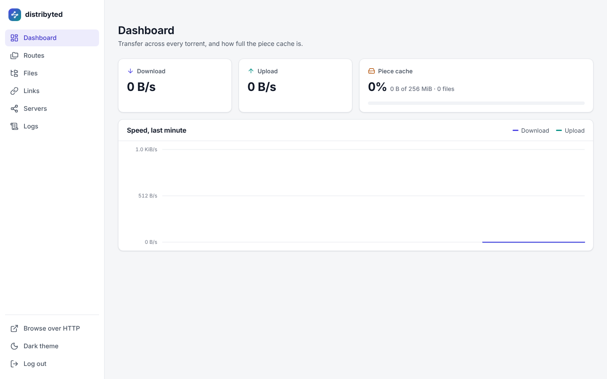
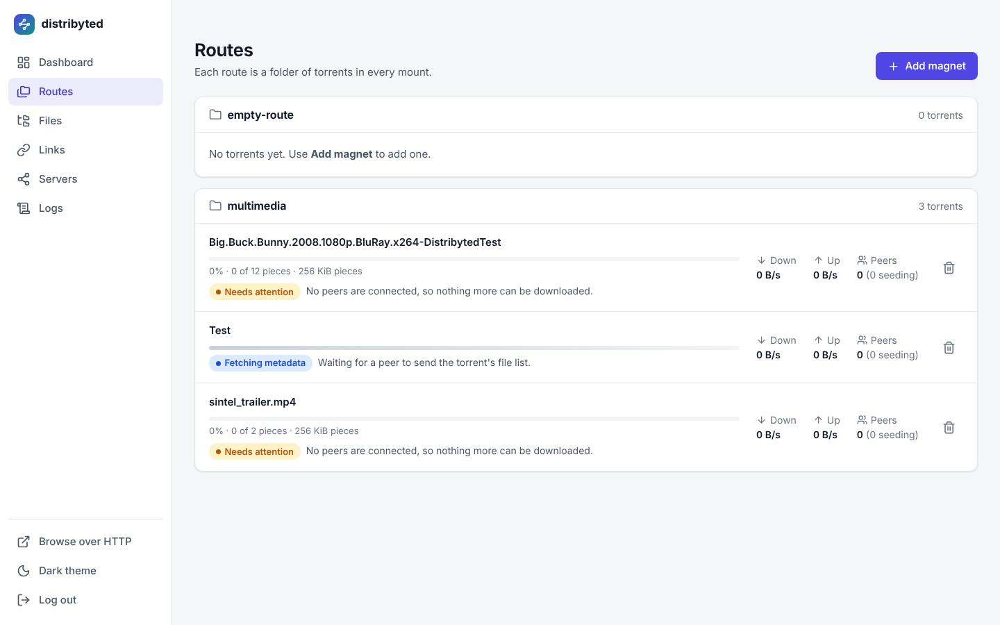
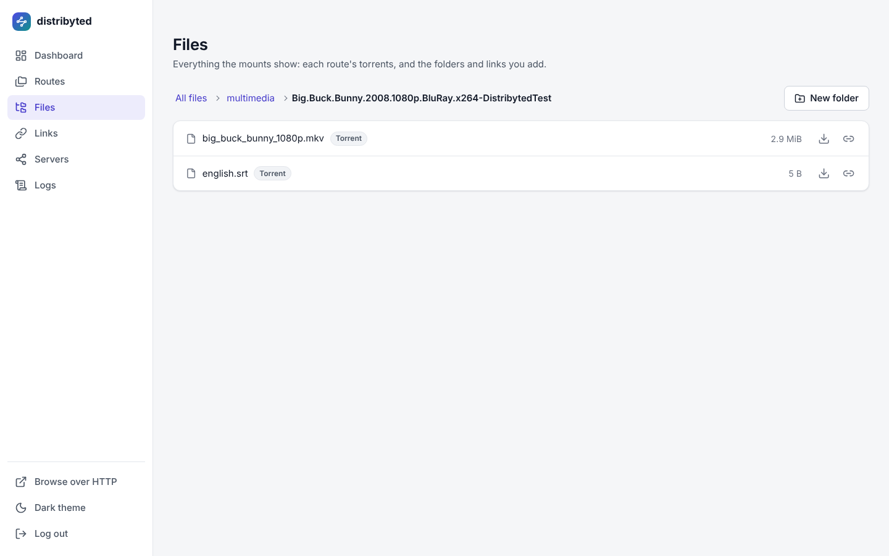
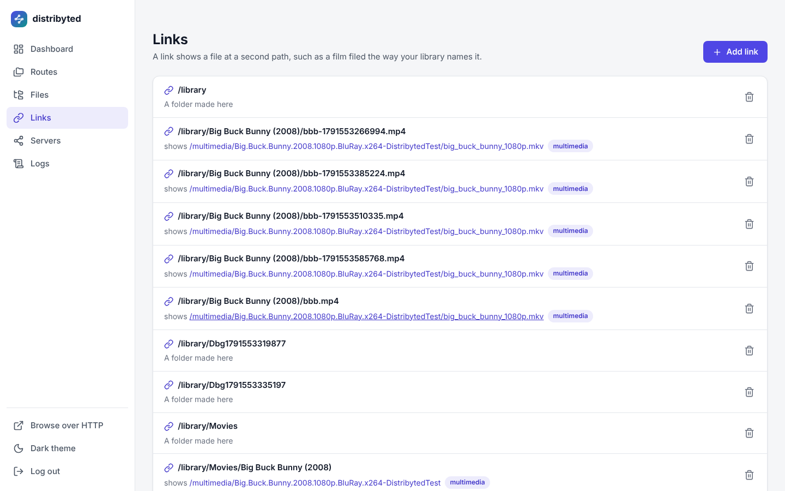
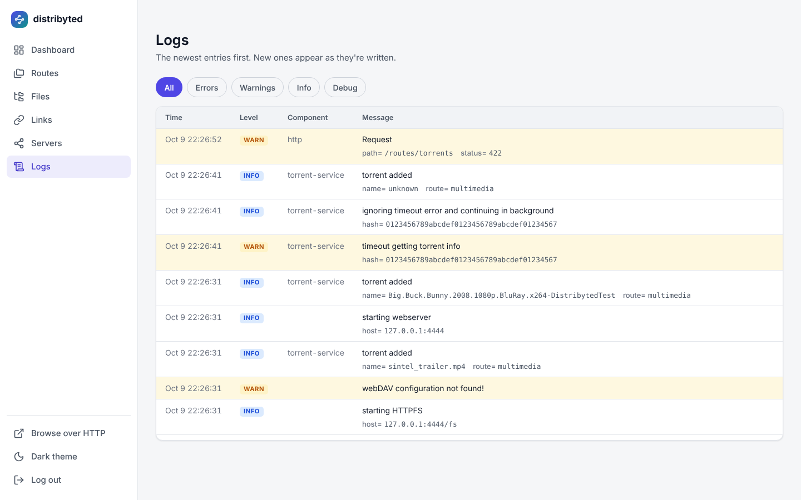
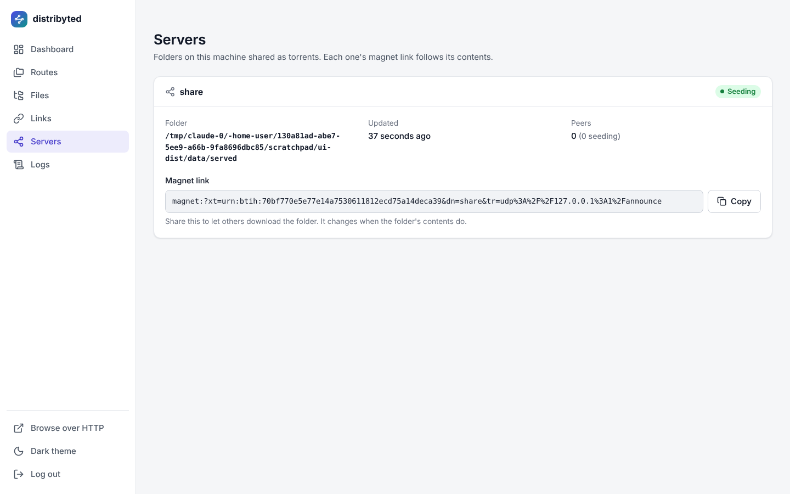
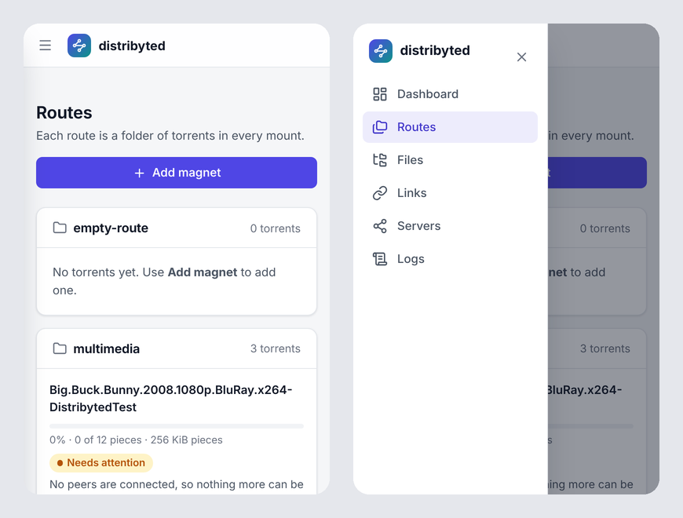

[![Releases][releases-shield]][releases-url]
[![GPL3 License][license-shield]][license-url]
[![Coveralls][coveralls-shield]][coveralls-url]

<!-- PROJECT LOGO -->
<br />
<p align="center">
  <a href="https://github.com/Apollogeddon/distribyted">
    
  </a>

  <h3 align="center">distribyted</h3>

  <p align="center">
    <b>Access Terabytes of data instantly using minimal local disk space.</b>
    <br />
    Torrent client with on-demand file downloading as a virtual filesystem.
    <br />
    <br />
    <a href="https://github.com/Apollogeddon/distribyted/issues">Report a Bug</a>
    ·
    <a href="https://github.com/Apollogeddon/distribyted/issues">Request Feature</a>
    ·
    <a href="https://apollogeddon.github.io/distribyted/docs/">Documentation</a>
  </p>
</p>

---

## 🚀 Use Cases

- **Multimedia:** Stream 4K movies directly in VLC or Plex without waiting for the full download.
- **Datasets:** Browse massive public datasets and only download the specific files or offsets needed for analysis.
- **Gaming:** Access large ROM collections or game backups directly from the filesystem.
- **Content Sharing:** Use the **Server** feature to instantly share a local folder with anyone via a magnet link.

<picture>
  <source media="(prefers-color-scheme: dark)" srcset="docs/static/images/screenshots/dashboard-dark.png">
  
</picture>

<details>
<summary>More of the web interface</summary>

<table>
<tr><th>Routes</th><th>Files</th></tr>
<tr><td><picture><source media="(prefers-color-scheme: dark)" srcset="docs/static/images/screenshots/routes-dark.png"></picture></td><td><picture><source media="(prefers-color-scheme: dark)" srcset="docs/static/images/screenshots/files-dark.png"></picture></td></tr>
<tr><th>Links</th><th>Logs</th></tr>
<tr><td><picture><source media="(prefers-color-scheme: dark)" srcset="docs/static/images/screenshots/links-dark.png"></picture></td><td><picture><source media="(prefers-color-scheme: dark)" srcset="docs/static/images/screenshots/logs-dark.png"></picture></td></tr>
<tr><th>Servers</th><th>On a phone</th></tr>
<tr><td><picture><source media="(prefers-color-scheme: dark)" srcset="docs/static/images/screenshots/servers-dark.png"></picture></td><td><picture><source media="(prefers-color-scheme: dark)" srcset="docs/static/images/screenshots/mobile-dark.png"></picture></td></tr>
</table>

</details>

## ✨ Core Features

- **Filesystem Access:** Mount torrents via **FUSE** (Linux/Windows), **WebDAV**, or **HTTP**.
- **On-Demand Downloading:** Only downloads the specific blocks of data being read.
- **Expandable Archives:** Automatically mount and seek through `.zip`, `.rar`, and `.7z` archives inside torrents.
- **Routes:** Organize different sets of torrents into virtual folders.
- **Servers:** Turn any local folder into a live torrent with automatic magnet link updates.
- **qBitTorrent API Compatibility:** Drop-in integration with **Radarr**, **Sonarr**, and **Prowlarr**.

## 🛠️ How it Works

Distribyted acts as a bridge between the BitTorrent swarm and your operating system. When a file is accessed:

1. The **Virtual Filesystem (VFS)** identifies which blocks of the torrent are needed.
2. The **Torrent Engine** requests only those specific pieces from the swarm.
3. Data is streamed directly to the requesting application, using a local cache for performance.

## 🏁 Quick Start

### 1. Configuration

The application uses a YAML configuration file. See `examples/conf_example.yaml` for a template.

### 2. Running

```bash
./distribyted --config examples/conf_example.yaml
```

### 3. Accessing Files

- **FUSE:** Mounted to `./distribyted-data/mount` (default).
- **WebDAV:** `http://localhost:36911` (Default: admin/admin).
- **Web UI:** `http://localhost:4444`

---

## 🔌 Integrations

### Radarr / Sonarr

Add `distribyted` as a **qBitTorrent** download client:

- **Host:** `localhost` | **Port:** `4444`
- **Category:** Use the name of one of your configured **Routes**.

### Supported qBitTorrent API (v2) Endpoints

- `POST /auth/login` (Session-cookie auth against `http.user`/`http.pass`)
- `GET /torrents/info` (Compatible listing)
- `POST /torrents/add` (Adds magnets to routes)
- `POST /torrents/delete` (Surgical removal)

## 📚 Documentation

The full guides are on the [documentation site](https://apollogeddon.github.io/distribyted/docs/) (source in [`docs/`](./docs/)):

- **[Workflows](https://apollogeddon.github.io/distribyted/docs/workflows/)**: Visual guides on system interactions and data flow.
- **[Configuration](https://apollogeddon.github.io/distribyted/docs/configuration/)**: Detailed YAML configuration guide.
- **[Integration](https://apollogeddon.github.io/distribyted/docs/integration/)**: Setup with Radarr, Sonarr, and Plex.
- **[Architecture](https://apollogeddon.github.io/distribyted/docs/architecture/)**: Learn how the internal VFS and Torrent engine work.
- **[Development](https://apollogeddon.github.io/distribyted/docs/development/)**: Guide for building from source and contributing.

## 🤝 Contributing

Contributions are welcome! Please check the [Development Guide](https://apollogeddon.github.io/distribyted/docs/development/) to get started.

## 📄 License

Distributed under the GPL3 license. See `LICENSE` for more information.

<!-- Links -->
[releases-shield]: https://img.shields.io/github/v/release/Apollogeddon/distribyted.svg?style=flat-square
[releases-url]: https://github.com/Apollogeddon/distribyted/releases
[license-shield]: https://img.shields.io/github/license/Apollogeddon/distribyted.svg?style=flat-square
[license-url]: https://github.com/Apollogeddon/distribyted/blob/main/LICENSE
[coveralls-shield]: https://img.shields.io/coveralls/github/Apollogeddon/distribyted?style=flat-square
[coveralls-url]: https://coveralls.io/github/Apollogeddon/distribyted
