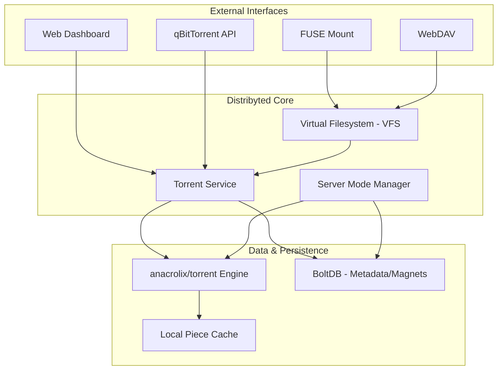
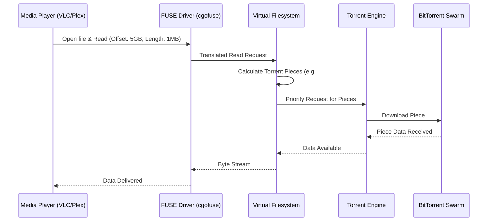
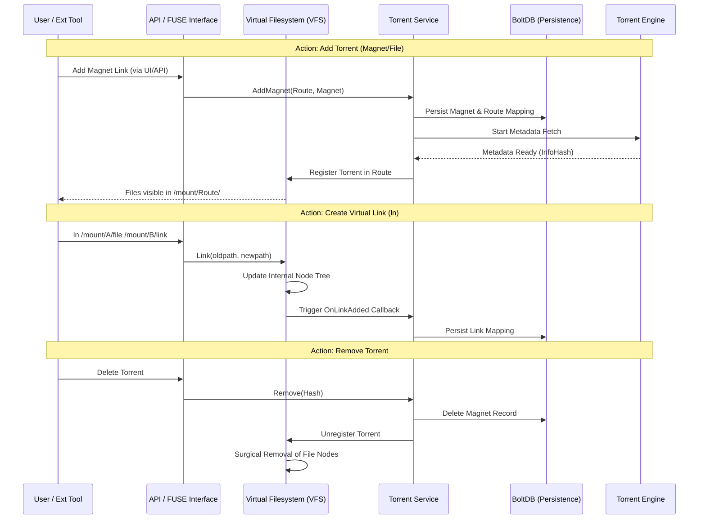
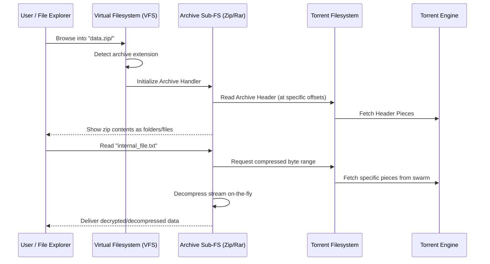

# Workflows

This guide illustrates how Distribyted operates and how different components interact to provide on-demand torrent access.

## High-Level System Architecture

The following diagram shows the relationship between external interfaces, the core management layers, and the BitTorrent swarm.

---

## Workflow: Adding a Torrent

When you add a torrent via the Web UI or an automation tool like Radarr, the system follows this path:

1.  **Request**: The interface (Web UI or API) sends a magnet link or torrent file to the **Torrent Service**.
2.  **Metadata Fetch**: The system announces to trackers/DHT to find peers and download the torrent metadata (Info Dictionary).
3.  **VFS Integration**: Once metadata is available, the **VFS** dynamically creates a virtual structure for the torrent.
4.  **Availability**: The files instantly appear in the FUSE mount and WebDAV interface as if they were already downloaded.

---

## Workflow: Reading a File (On-Demand)

This is the core "on-demand" workflow where data is streamed from the swarm as requested by an application.

1.  **Read Request**: An application requests a specific byte range of a file.
2.  **Piece Mapping**: The VFS identifies exactly which BitTorrent pieces contain that data range.
3.  **Swarm Request**: The Torrent Engine requests those pieces with the highest priority from connected peers.
4.  **Streaming**: As data arrives, it is passed back through the VFS to the requesting application.

---

## Command & Action Workflows

The following diagram maps the internal system calls and persistence steps triggered by common external actions.

### Key Interaction Details
- **Persistence First**: Whenever a torrent or link is added, it is first persisted to **BoltDB** before the VFS is updated. This ensures that the state is recoverable if the application crashes during metadata fetching.
- **Dynamic VFS**: The VFS does not require a restart to show new torrents. The `TorrentService` triggers a callback that injects the new file nodes directly into the active `ContainerFs`.
- **Surgical Removal**: When a torrent is removed, the VFS performs a "surgical removal," only deleting the specific file nodes associated with that torrent's InfoHash, leaving other routes and links intact.

---

## Workflow: On-the-Fly Archive Mounting

Distribyted can treat compressed archives as folders. This involves a "nested" filesystem interaction.

---

## Workflow: Cache Lifecycle (LRU)

To keep local disk usage low, Distribyted uses a **Least Recently Used (LRU)** cache.

1.  **Incoming Data**: As pieces arrive from the swarm, they are written to the `metadata/cache` folder.
2.  **Usage**: The system tracks which pieces are being accessed by the VFS.
3.  **Capacity Check**: Once the total size of the cache reaches the `global_cache_size` (e.g., 2GB), the eviction process begins.
4.  **Eviction**: The oldest/least accessed pieces are deleted from the disk to make room for new data.
5.  **Metadata Preservation**: Note that **Torrent Metadata** (the file list and piece hashes) is never evicted; only the actual file data pieces are cycled.

